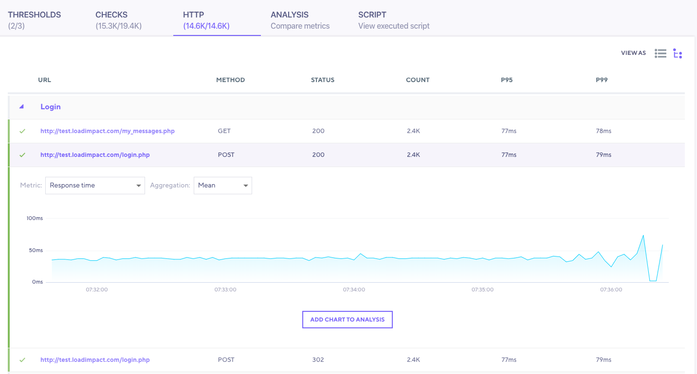

## Cloud Results: HTTP Tab

The HTTP Tab allow you to inspect individual HTTP requests made in your test. The number in the tab represents total passing HTTP Requests / Total HTTP Requests. This provides a quick hint to any failing requests. Displayed in the tab will be a row for each HTTP request by resource, method used, and status code returned. If an endpoint has multiple request methods or status codes, we separate them. Note the login endpoint which was requested via a POST but has had two different status codes returned, 200 and 302.

On this tab, we can easily see `HTTP` requests with failures that have failures. Take notice of the &#10003; on the left of each row. If we had failures they would be marked with a &#10005;

When you click on a row to expand, you can also:

- View additional metrics for the request, such as time spent handshaking
- Change the aggregation (Mean, Median, Min, Max, Std Deviation, or 95th percentile)
- Add the chart (plus additional metrics) to the analysis tab.

Next, [Analysis Tab](/cloud/analyzing-results/analysis-tab)
